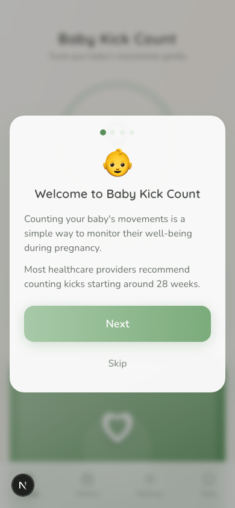
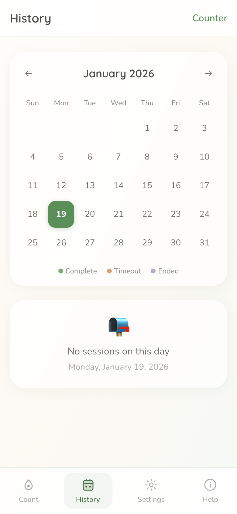
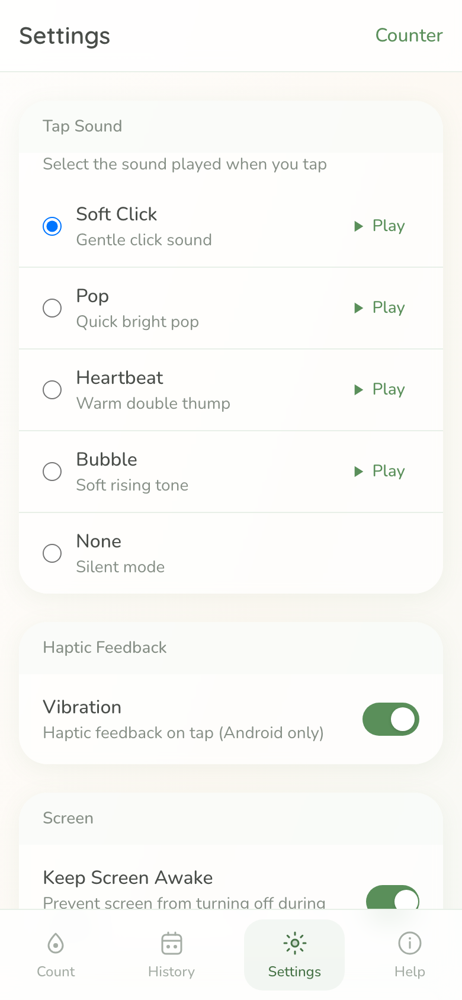

# When Love Meets Code: Building Baby Kick Count for My Wife

*How frustration with existing apps led to building something better—and testing a new AI development workflow along the way.*

---

My wife Andrea is pregnant, and like many expectant parents, she wanted to track our baby's movements. Kick counting is a simple but important practice—healthcare providers recommend it starting around 28 weeks as a way to monitor the baby's well-being. The premise is straightforward: count 10 movements within a 2-hour window, and you've got a healthy, active baby.

Simple, right? So why are all the apps so *complicated*?

## The Problem with Existing Apps

Andrea tried several kick counter apps. Every. Single. One. left her frustrated.

**The complaints were consistent:**
- Cluttered interfaces with too many features
- Aggressive ads interrupting the counting experience
- Confusing navigation that required multiple taps to do one thing
- No simple way to see patterns over time
- Anxiety-inducing design when the whole point should be *reassurance*

"I just want to tap when I feel a kick," she said. "Why is that so hard?"

She was right. For something that pregnant people might use multiple times a day, during what can already be an anxious time, the experience should be *calming*, not stressful. She wanted something clean, simple, and—crucially—a calendar view to track daily counts at a glance.

So I built it for her.

## Design Philosophy: Calm Over Clutter

The design direction was clear from the start: **this should feel like a meditation app, not a medical device**.

I chose a soft sage green palette with warm cream accents. The typography uses Quicksand—a rounded, friendly font that feels gentle rather than clinical. Every element has generous padding and breathing room. There are no harsh edges, no alarming reds, no countdown timers screaming at you.

The main interaction is a large heart-shaped tap area that takes up most of the screen. One tap = one kick recorded. That's it. The satisfying ripple animation and optional sound feedback make each tap feel *good*—a small moment of connection with the baby.

**Key design decisions:**

1. **Large touch target (320px)** — Easy to tap without looking, even while doing other things
2. **Subtle breathing animation** — The decorative circle gently pulses, creating a calm rhythm
3. **Muted color palette** — Sage greens and creams instead of bright pinks or blues
4. **Minimal chrome** — No unnecessary buttons, no feature bloat
5. **Clear progress** — A simple "X/10" counter and timer, nothing more

## The Calendar View Andrea Wanted

One of Andrea's specific requests was a calendar to see patterns over time. Not every healthcare provider uses the "10 kicks in 2 hours" rule identically—what matters most is knowing your baby's *normal* pattern and recognizing when something changes.

The calendar shows each day with color-coded dots:
- **Green** — Completed sessions (reached 10 kicks)
- **Orange** — Timeout sessions (2 hours passed)
- **Purple** — Ended early by choice

Tap any day to see that day's sessions with detailed timestamps. Over weeks, you build a picture of your baby's activity patterns—and that's exactly what healthcare providers want you to track.

## Thoughtful Details That Matter

### Customizable Tap Sounds

Not everyone wants the same feedback. Some people prefer silence during quiet moments; others want satisfying audio confirmation.

I built a synthesized sound system (no audio files to load) with five options:
- **Soft Click** — Gentle, minimal
- **Pop** — Quick and bright
- **Heartbeat** — A warm double-thump (my favorite)
- **Bubble** — Soft rising tone
- **None** — Complete silence

### Haptic Feedback

A subtle vibration on each tap provides tactile confirmation—especially useful when you're not looking at the screen. (Note: This works on Android; iOS restricts vibration access for web apps.)

### Keep Screen Awake

Nobody wants their phone to sleep mid-session. The app uses the Wake Lock API to keep the screen on while counting, so you never have to fumble to unlock your phone after feeling a kick.

### Offline-First

This was non-negotiable. Pregnant people count kicks everywhere—at home, at work, in waiting rooms, on planes. The app uses IndexedDB (via Dexie.js) to store everything locally. No account required. No data sent anywhere. Works without internet, always.

Every tap writes to the database within 200ms. If your phone dies or the browser crashes, your session picks up right where you left off.

## Grounded in Medical Guidance

I didn't want to invent arbitrary thresholds. The "10 movements in 2 hours" guideline comes from the [Cleveland Clinic](https://my.clevelandclinic.org/) and is widely recommended by healthcare providers. The [NHS](https://www.nhs.uk/) emphasizes pattern awareness—knowing what's normal for *your* baby—over strict numeric goals.

The app includes clear messaging throughout:

> *If fetal movements change abruptly, slow down, or stop, contact your healthcare provider immediately.*

This isn't a diagnostic tool. It's a simple way to be mindful of your baby's movements and catch changes early.

## The Tech Stack

For the technically curious:

- **Next.js 15 + React 19** — Modern React with server components
- **Tailwind CSS** — Utility-first styling for rapid iteration
- **Dexie.js** — IndexedDB wrapper for offline-first persistence
- **Web Audio API** — Synthesized sounds without audio file downloads
- **Wake Lock API** — Keep screen awake during sessions
- **PWA** — Installable on home screen for native-app feel

The architecture separates concerns cleanly:
- **Services** handle business logic (sessions, kicks, preferences)
- **State machine** manages session lifecycle (active → paused → complete)
- **React Context** provides state to components
- **Custom hooks** encapsulate behaviors (wake lock, before-unload warnings)

## A Test Drive for Ralph Loop

Here's where it gets meta: this app was also a trial run for something I've been developing called **Ralph Loop**—a new approach to AI-assisted coding within Claude Code.

The idea is to create a more structured, iterative workflow where AI handles implementation while I focus on product decisions and validation. Baby Kick Count was the perfect test case: a real product with a real user (Andrea), clear requirements, and enough complexity to stress-test the workflow.

The results? Promising enough that I'm writing a separate deep-dive post about Ralph Loop itself. Stay tuned for that one.

## Andrea's Verdict

After using the app for a few weeks, Andrea's feedback has been overwhelmingly positive:

*"Finally, an app that doesn't make me feel anxious. I tap, I see the count, I'm done. The calendar is exactly what I wanted."*

She's been using it daily, and watching the calendar fill up with green dots has become its own small joy—a visual record of our baby's activity, one kick at a time.

## What's Next

**Baby Kick Count is live now at [babykickcount.com](https://babykickcount.com)**

It's a web app that works beautifully on phones when added to your home screen. No app store, no download, no account—just open the link and start counting.

Coming soon:
- **Apple Watch app** — Because reaching for your phone isn't always convenient
- **Data export** — For sharing with healthcare providers
- **Partner sharing** — So both parents can log kicks

---

## Try It Yourself

If you or someone you know is expecting, give Baby Kick Count a try:

**[Launch Baby Kick Count →](https://babykickcount.com)**

The app is free, ad-free, and always will be. No tracking, no accounts, no nonsense. Just a simple tool built with love for the person I love.

*And if you're curious about the Ralph Loop development workflow that helped bring this to life, that post is coming soon.*

---

**P.S.** — The code is open source if you want to peek under the hood. Sometimes the best apps come from solving problems for the people closest to you.

---

*Built with love for Andrea and our little one* 🤍
