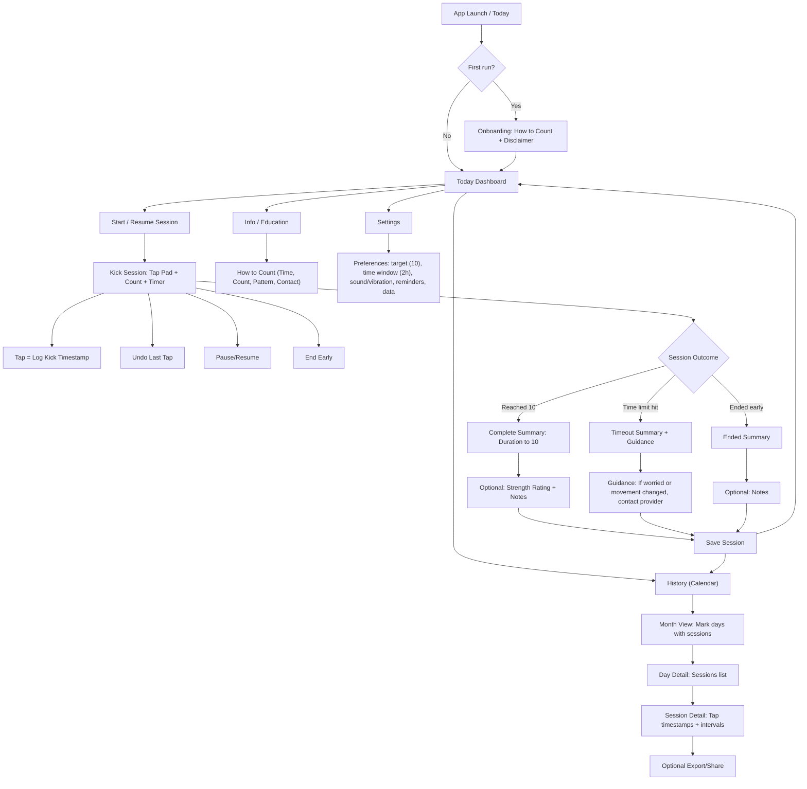

## One-page UI flow diagram for the Web App

This flow keeps the **“tap like a beat counter”** experience central, while supporting the “**time how long it takes to feel 10 movements** (ideally within **2 hours**)” method and pattern-awareness guidance. ([Cleveland Clinic][1])

### Screen-by-screen notes (so the diagram is buildable)

**1) Today Dashboard**

* Primary CTA: **Start Counting / Resume**
* Shows last session: “Yesterday: 10 kicks in 23m” + trend hint (“Typical for you: ~20–35m”)
* Quick links: History (calendar), Info, Settings

**2) Onboarding / Info**

* “How to Count” steps reflect mainstream “count-to-ten” guidance: pick a time, get comfortable, start timer, count to 10, record minutes. ([Cleveland Clinic][1])
* Also includes a “pattern matters” emphasis (know your baby’s normal; contact provider if something feels off). Count the Kicks explicitly emphasizes comparing sessions and contacting the hospital/provider if there’s a change. ([Count the Kicks][2])
* Regional/clinical guidance differs: NHS emphasizes there is **no set number** and to call immediately if movement is less/changed; Kicks Count UK explicitly warns against “10 kicks in 2 hours” as a universal rule. Your app can default to 10/2h, but **copy should prioritize “if concerned, contact provider now.”** ([nhs.uk][3])

**3) Kick Session (Beat-counter feel)**

* Big tap pad (full width, tall). Each tap = “kick event” with timestamp.
* Show:

  * `X / 10`
  * elapsed + remaining time (to 2:00:00)
  * optional “interval since last tap”
* Controls: Undo, Pause/Resume, End Early
* Outcomes:

  * Complete at 10 (record duration)
  * Timeout at 2 hours (save incomplete + show guidance)
  * End early (save partial)

**4) History (Calendar + Session Detail)**

* Month view with dots/badges on days with sessions
* Day view list (time started, duration, complete/timeout)
* Session detail shows timestamp list and intervals; supports export later

---

## MVP backlog with Epics → Stories → Acceptance Criteria

I’m scoping this as a **Web MVP first** with **offline-first local persistence**, and aligning key product behaviors to:

* Cleveland Clinic “count to 10 / ideally within 2 hours” + “don’t panic; contact provider if still can’t feel movement” guidance ([Cleveland Clinic][1])
* Count the Kicks product expectations: track time to 10, trend/pattern awareness, reminders, strength rating, download/share data ([Count the Kicks][4])
* Awareness that some orgs emphasize “know your normal pattern” and not strict thresholds ([nhs.uk][3])

### Epic 0 — Product safety, educational content, and disclaimers (must ship)

**Story 0.1 — Show “How to Count” guidance**

* **AC**

  * Given a new user, when they open the app the first time, then they see a “How to Count” guide with steps (choose time, get comfortable, start timer, count each movement to 10, record minutes). ([Cleveland Clinic][1])
  * Guide is always reachable from the main nav (Info page).

**Story 0.2 — Escalation guidance that doesn’t encourage waiting if concerned**

* **AC**

  * Info page includes: “If you notice a change/reduction or are worried, contact your provider/maternity unit right away.” (pattern-first message) ([nhs.uk][3])
  * Timeout screen includes: “If you still can’t feel movement, contact your healthcare provider for advice.” ([Cleveland Clinic][1])
  * Content includes clear “educational only” disclaimer.

**Story 0.3 — Guidance mode & defaults**

* **AC**

  * Default mode: “Count to 10 within 2 hours” (configurable). ([Cleveland Clinic][1])
  * A settings note mentions guidance can vary and emphasizes knowing your baby’s normal pattern. ([nhs.uk][3])

---

### Epic 1 — App shell (PWA) + navigation

**Story 1.1 — App layout and routes**

* **AC**

  * App has routes: Today, History, Info, Settings
  * Navigation works on mobile and desktop
  * App is responsive and accessible (keyboard navigation, ARIA labels)

**Story 1.2 — PWA install + offline shell**

* **AC**

  * App can be installed as a PWA
  * App shell loads offline (cached assets)
  * Offline status does not block counting sessions

---

### Epic 2 — Kick session (beat-counter interaction)

**Story 2.1 — Start session and tap-to-log**

* **AC**

  * Given user is on Today, when they tap “Start Counting,” then an active session begins
  * When user taps the big pad, the count increments immediately and a timestamped kick event is created
  * UI shows `X/10`, elapsed time, remaining time (2 hours default)

**Story 2.2 — Auto-complete at 10**

* **AC**

  * When `count == 10`, session ends automatically and shows summary including “minutes to 10” ([Cleveland Clinic][1])
  * Summary is saved into history

**Story 2.3 — Undo last tap**

* **AC**

  * Undo removes the most recent kick event and decrements count
  * Undo is disabled at count = 0
  * Undo updates persistence and UI correctly after refresh

**Story 2.4 — Timeout at 2 hours**

* **AC**

  * If elapsed time reaches 2:00:00 before 10, session status becomes “Timeout”
  * Timeout summary is saved and shows supportive guidance to contact provider if movement still isn’t felt ([Cleveland Clinic][1])

**Story 2.5 — End early**

* **AC**

  * User can end early with confirmation
  * Session is saved as “Ended early” with count and elapsed time

---

### Epic 3 — Persistence, recovery, and data integrity (trust-critical)

**Story 3.1 — Persist every tap**

* **AC**

  * Each kick event is persisted within 200ms of a tap (local database)
  * If the page is refreshed, events are not lost

**Story 3.2 — Resume active session after refresh**

* **AC**

  * Given an active session, when user refreshes/reopens, then the session resumes with correct count and elapsed time

**Story 3.3 — Prevent accidental loss**

* **AC**

  * If session is active and user attempts to close/refresh, app shows a “you have an active session” warning (where supported)

---

### Epic 4 — History and calendar

**Story 4.1 — Calendar month view**

* **AC**

  * Calendar shows the current month
  * Days with ≥1 session have an indicator (dot/badge)
  * Clicking a day opens day detail list

**Story 4.2 — Day detail list**

* **AC**

  * Shows sessions with: start time, outcome (complete/timeout/ended), and duration (time to 10 or elapsed)

**Story 4.3 — Session detail**

* **AC**

  * Shows tap timestamps and intervals
  * Shows notes/strength if present

---

### Epic 5 — Preferences (defaults + UX controls)

**Story 5.1 — Set target and time window**

* **AC**

  * User can change default target count (default 10) and time limit (default 2 hours) ([Cleveland Clinic][1])
  * New sessions use updated defaults

**Story 5.2 — Sound/vibration toggles**

* **AC**

  * User can enable/disable tap sound
  * User can enable/disable vibration (where supported)

**Story 5.3 — Data controls**

* **AC**

  * User can delete all local data from Settings
  * App confirms before deletion

---

### Epic 6 — “Nice next” (post-MVP but planned)

These mirror strong expectations set by Count the Kicks:

* reminders, strength rating, export/share ([Count the Kicks][4])

**Story 6.1 — Strength rating (1–5)**

* **AC**

  * After saving a session, user can rate strength 1–5 and save
  * Rating appears in history detail ([Count the Kicks][4])

**Story 6.2 — Reminders**

* **AC**

  * User can set reminder cadence (e.g., daily) aligned with “count every day” messaging ([Count the Kicks][4])

**Story 6.3 — Export/share**

* **AC**

  * User can export last 7/14 days summary + session list as CSV/PDF
  * Export includes time-to-10 trend and flags timeouts ([Count the Kicks][4])

---

## MVP sprint plan (practical cut)

Assuming **2-week sprints**, this ships a solid web MVP in **2 sprints**, with a third optional “polish/export” sprint.

### Sprint 0 (setup + foundations)

* 1.1 App layout/routes
* 1.2 PWA + offline shell
* 3.1 Local persistence scaffolding (IndexedDB schema + DAL)
* 0.1/0.2 Initial Info/Disclaimer pages

**Exit criteria**

* App installs as PWA, loads offline, routes working, data layer integrated.

### Sprint 1 (core counting loop)

* 2.1 Start session + tap pad + timer
* 2.2 Auto-complete at 10
* 2.3 Undo
* 2.4 Timeout at 2 hours + guidance copy ([Cleveland Clinic][1])
* 3.2 Resume after refresh

**Exit criteria**

* You can reliably run sessions end-to-end and never lose taps.

### Sprint 2 (history + settings + usability)

* 4.1 Calendar view
* 4.2 Day detail list
* 4.3 Session detail
* 5.1 Set target/time window defaults (keep default 10/2h) ([Cleveland Clinic][1])
* 5.2 Sound/vibration toggles
* 5.3 Delete all data

**Exit criteria**

* Users can count, review history in calendar, adjust defaults, and trust persistence.

### Sprint 3 (optional “make it competitive”)

* 6.1 Strength rating ([Count the Kicks][4])
* 6.2 Reminders (browser notifications) ([Count the Kicks][4])
* 6.3 Export/share ([Count the Kicks][4])
* Accessibility and performance polish

---

If you want the next concrete artifact, I can convert this backlog into a **Jira-ready structure** (Epics → Stories → Tasks) with **Given/When/Then** acceptance criteria already formatted, and a suggested **data model + IndexedDB schema** that matches the stories.

[1]: https://my.clevelandclinic.org/health/articles/23497-kick-counts "Kick Counts (Fetal Movement Counting): Purpose & How To"
[2]: https://countthekicks.org/why-we-count/how-to-count-the-kicks/ "How to Count - Count the Kicks"
[3]: https://www.nhs.uk/pregnancy/keeping-well/your-babys-movements/ "Your baby's movements - NHS"
[4]: https://countthekicks.org/download-app/ "Download the App - Count the Kicks"
